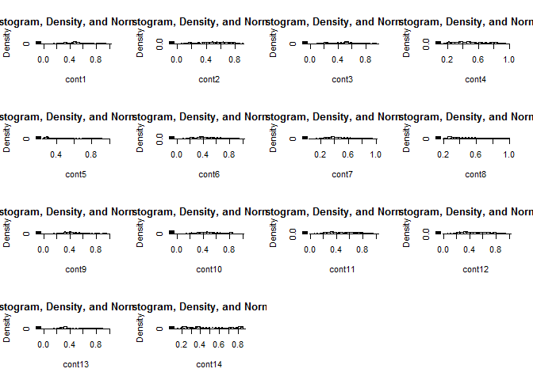
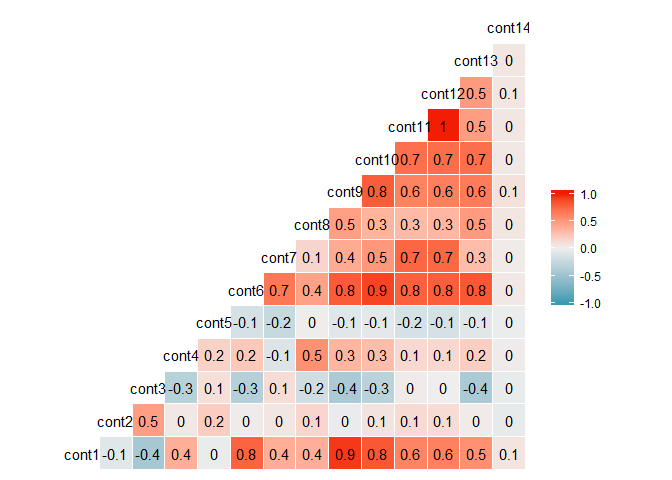
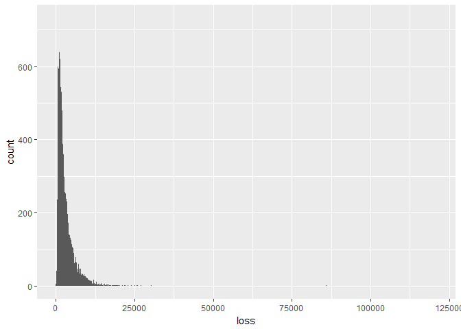
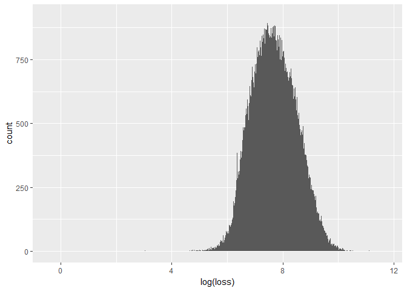
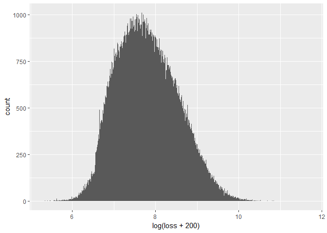

Allstate data overview
================
LipingLi
2016.12.23

### Important data

``` r
library(data.table)
train = fread("C:/data/train-allstate.csv", sep = ",", stringsAsFactors = T)
```

    ## 
    Read 42.5% of 188318 rows
    Read 74.3% of 188318 rows
    Read 188318 rows and 132 (of 132) columns from 0.065 GB file in 00:00:05

``` r
summary(train)
```

    ##        id         cat1       cat2       cat3       cat4       cat5      
    ##  Min.   :     1   A:141550   A:106721   A:177993   A:128395   A:123737  
    ##  1st Qu.:147748   B: 46768   B: 81597   B: 10325   B: 59923   B: 64581  
    ##  Median :294540                                                         
    ##  Mean   :294136                                                         
    ##  3rd Qu.:440681                                                         
    ##  Max.   :587633                                                         
    ##                                                                         
    ##  cat6       cat7       cat8       cat9       cat10      cat11     
    ##  A:131693   A:183744   A:177274   A:113122   A:160213   A:168186  
    ##  B: 56625   B:  4574   B: 11044   B: 75196   B: 28105   B: 20132  
    ##                                                                   
    ##                                                                   
    ##                                                                   
    ##                                                                   
    ##                                                                   
    ##  cat12      cat13      cat14      cat15      cat16      cat17     
    ##  A:159825   A:168851   A:186041   A:188284   A:181843   A:187009  
    ##  B: 28493   B: 19467   B:  2277   B:    34   B:  6475   B:  1309  
    ##                                                                   
    ##                                                                   
    ##                                                                   
    ##                                                                   
    ##                                                                   
    ##  cat18      cat19      cat20      cat21      cat22      cat23     
    ##  A:187331   A:186510   A:188114   A:187905   A:188275   A:157445  
    ##  B:   987   B:  1808   B:   204   B:   413   B:    43   B: 30873  
    ##                                                                   
    ##                                                                   
    ##                                                                   
    ##                                                                   
    ##                                                                   
    ##  cat24      cat25      cat26      cat27      cat28      cat29     
    ##  A:181977   A:169969   A:177119   A:168250   A:180938   A:184593  
    ##  B:  6341   B: 18349   B: 11199   B: 20068   B:  7380   B:  3725  
    ##                                                                   
    ##                                                                   
    ##                                                                   
    ##                                                                   
    ##                                                                   
    ##  cat30      cat31      cat32      cat33      cat34      cat35     
    ##  A:184760   A:182980   A:187107   A:187361   A:187734   A:188105  
    ##  B:  3558   B:  5338   B:  1211   B:   957   B:   584   B:   213  
    ##                                                                   
    ##                                                                   
    ##                                                                   
    ##                                                                   
    ##                                                                   
    ##  cat36      cat37      cat38      cat39      cat40      cat41     
    ##  A:156313   A:165729   A:169323   A:183393   A:180119   A:181177  
    ##  B: 32005   B: 22589   B: 18995   B:  4925   B:  8199   B:  7141  
    ##                                                                   
    ##                                                                   
    ##                                                                   
    ##                                                                   
    ##                                                                   
    ##  cat42      cat43      cat44      cat45      cat46      cat47     
    ##  A:186623   A:184110   A:172716   A:183991   A:187436   A:187617  
    ##  B:  1695   B:  4208   B: 15602   B:  4327   B:   882   B:   701  
    ##                                                                   
    ##                                                                   
    ##                                                                   
    ##                                                                   
    ##                                                                   
    ##  cat48      cat49      cat50      cat51      cat52      cat53     
    ##  A:188049   A:179127   A:137611   A:187071   A:179505   A:172949  
    ##  B:   269   B:  9191   B: 50707   B:  1247   B:  8813   B: 15369  
    ##                                                                   
    ##                                                                   
    ##                                                                   
    ##                                                                   
    ##                                                                   
    ##  cat54      cat55      cat56      cat57      cat58      cat59     
    ##  A:183762   A:188173   A:188136   A:185296   A:188079   A:188018  
    ##  B:  4556   B:   145   B:   182   B:  3022   B:   239   B:   300  
    ##                                                                   
    ##                                                                   
    ##                                                                   
    ##                                                                   
    ##                                                                   
    ##  cat60      cat61      cat62      cat63      cat64      cat65     
    ##  A:187872   A:187596   A:188273   A:188239   A:188271   A:186056  
    ##  B:   446   B:   722   B:    45   B:    79   B:    47   B:  2262  
    ##                                                                   
    ##                                                                   
    ##                                                                   
    ##                                                                   
    ##                                                                   
    ##  cat66      cat67      cat68      cat69      cat70      cat71     
    ##  A:179982   A:187626   A:188176   A:188011   A:188295   A:178646  
    ##  B:  8336   B:   692   B:   142   B:   307   B:    23   B:  9672  
    ##                                                                   
    ##                                                                   
    ##                                                                   
    ##                                                                   
    ##                                                                   
    ##  cat72      cat73      cat74      cat75      cat76      cat77     
    ##  A:118322   A:154275   A:184731   A:154307   A:181347   A:    49  
    ##  B: 69996   B: 34017   B:  3561   B: 34010   B:  6183   B:   358  
    ##             C:    26   C:    26   C:     1   C:   788   C:   408  
    ##                                                         D:187503  
    ##                                                                   
    ##                                                                   
    ##                                                                   
    ##  cat78      cat79      cat80      cat81      cat82      cat83     
    ##  A:   788   A:  7064   A:   783   A:   788   A: 19322   A: 26038  
    ##  B:186526   B:152929   B: 46538   B: 24132   B:147536   B:141534  
    ##  C:   645   C:  1668   C:  3492   C:  9013   C:  2655   C:  4958  
    ##  D:   359   D: 26657   D:137505   D:154385   D: 18805   D: 15788  
    ##                                                                   
    ##                                                                   
    ##                                                                   
    ##  cat84      cat85      cat86      cat87      cat88          cat89       
    ##  A: 29450   A:   788   A:  1589   A:   788   A:168926   A      :183744  
    ##  B:   431   B:186005   B:103852   B:166992   B:     7   B      :  4312  
    ##  C:154939   C:  1011   C: 10290   C:  8819   D: 19302   C      :   220  
    ##  D:  3498   D:   514   D: 72587   D: 11719   E:    83   D      :    33  
    ##                                                         E      :     5  
    ##                                                         I      :     2  
    ##                                                         (Other):     2  
    ##  cat90          cat91        cat92      cat93      cat94      cat95    
    ##  A:177993   A      :111028   A:124689   A:   432   A:   738   A: 3736  
    ##  B:  9515   B      : 42630   B:   628   B:  1133   B: 51710   B:  109  
    ##  C:   728   G      : 26734   C:    62   C: 35788   C: 13623   C:87531  
    ##  D:    70   C      :  6400   D:    11   D:150237   D:121642   D:79525  
    ##  E:     6   D      :  1149   F:     1   E:   728   E:    91   E:17417  
    ##  F:     4   E      :   254   H: 62901              F:   494            
    ##  G:     2   (Other):   123   I:    26              G:    20            
    ##      cat96        cat97     cat98          cat99           cat100     
    ##  E      :174360   A:41970   A:105492   P      :79455   F      :42970  
    ##  D      :  7922   B:   34   B:   542   T      :72591   I      :39933  
    ##  B      :  2957   C:78127   C: 21485   R      :10290   L      :19961  
    ##  G      :  2665   D: 3779   D: 50557   D      : 8844   K      :13817  
    ##  F      :   343   E:47450   E: 10242   S      : 7045   G      :12935  
    ##  A      :    35   F:  213              N      : 2894   J      :12027  
    ##  (Other):    36   G:16745              (Other): 7199   (Other):46675  
    ##      cat101           cat102           cat103           cat104     
    ##  A      :106721   A      :177274   A      :123737   E      :42925  
    ##  D      : 17171   B      :  5155   B      : 33342   G      :40660  
    ##  C      : 16971   C      :  4929   C      : 16508   D      :27611  
    ##  G      : 10944   E      :   482   D      :  7806   F      :19228  
    ##  F      : 10139   D      :   449   E      :  4473   H      :17187  
    ##  J      :  7259   G      :    15   F      :  1528   K      :14297  
    ##  (Other): 19113   (Other):    14   (Other):   924   (Other):26410  
    ##      cat105          cat106          cat107          cat108     
    ##  E      :76493   G      :47165   F      :47310   B      :65512  
    ##  F      :62892   H      :37713   G      :28560   K      :42435  
    ##  G      :20613   F      :36143   H      :23461   G      :21421  
    ##  D      :12172   I      :21433   J      :22405   D      :19160  
    ##  H      :11258   J      :18281   K      :20236   F      :10242  
    ##  I      : 2941   E      :13000   I      :20066   A      : 9299  
    ##  (Other): 1949   (Other):14583   (Other):26280   (Other):20249  
    ##      cat109           cat110          cat111           cat112     
    ##  BI     :152918   CL     :25305   A      :128395   E      :25148  
    ##  AB     : 21933   EG     :24654   C      : 32401   AH     :18639  
    ##  BU     :  3142   CS     :24592   E      : 14682   AS     :17669  
    ##  K      :  2999   EB     :21396   G      :  7039   J      :16222  
    ##  G      :  1353   CO     :17495   I      :  3578   AF     : 9368  
    ##  BQ     :  1067   BT     :16365   K      :  1353   AN     : 9138  
    ##  (Other):  4906   (Other):58511   (Other):   870   (Other):92134  
    ##      cat113          cat114           cat115          cat116      
    ##  BM     :26191   A      :131693   K      :43866   HK     : 21061  
    ##  AE     :22030   C      : 16793   O      :26813   DJ     : 20244  
    ##  L      :13058   E      : 16475   J      :23895   CK     : 10162  
    ##  AX     :12661   J      :  8199   N      :22438   DP     :  9202  
    ##  Y      :11374   F      :  7905   P      :21538   GS     :  8736  
    ##  K      : 7738   N      :  2455   L      :16125   CR     :  6862  
    ##  (Other):95266   (Other):  4798   (Other):33643   (Other):112051  
    ##      cont1              cont2              cont3              cont4       
    ##  Min.   :0.000016   Min.   :0.001149   Min.   :0.002634   Min.   :0.1769  
    ##  1st Qu.:0.346090   1st Qu.:0.358319   1st Qu.:0.336963   1st Qu.:0.3274  
    ##  Median :0.475784   Median :0.555782   Median :0.527991   Median :0.4529  
    ##  Mean   :0.493861   Mean   :0.507188   Mean   :0.498918   Mean   :0.4918  
    ##  3rd Qu.:0.623912   3rd Qu.:0.681761   3rd Qu.:0.634224   3rd Qu.:0.6521  
    ##  Max.   :0.984975   Max.   :0.862654   Max.   :0.944251   Max.   :0.9543  
    ##                                                                           
    ##      cont5            cont6             cont7            cont8       
    ##  Min.   :0.2811   Min.   :0.01268   Min.   :0.0695   Min.   :0.2369  
    ##  1st Qu.:0.2811   1st Qu.:0.33610   1st Qu.:0.3502   1st Qu.:0.3128  
    ##  Median :0.4223   Median :0.44094   Median :0.4383   Median :0.4411  
    ##  Mean   :0.4874   Mean   :0.49094   Mean   :0.4850   Mean   :0.4864  
    ##  3rd Qu.:0.6433   3rd Qu.:0.65502   3rd Qu.:0.5910   3rd Qu.:0.6236  
    ##  Max.   :0.9837   Max.   :0.99716   Max.   :1.0000   Max.   :0.9802  
    ##                                                                      
    ##      cont9             cont10           cont11            cont12       
    ##  Min.   :0.00008   Min.   :0.0000   Min.   :0.03532   Min.   :0.03623  
    ##  1st Qu.:0.35897   1st Qu.:0.3646   1st Qu.:0.31096   1st Qu.:0.31166  
    ##  Median :0.44145   Median :0.4612   Median :0.45720   Median :0.46229  
    ##  Mean   :0.48551   Mean   :0.4981   Mean   :0.49351   Mean   :0.49315  
    ##  3rd Qu.:0.56682   3rd Qu.:0.6146   3rd Qu.:0.67892   3rd Qu.:0.67576  
    ##  Max.   :0.99540   Max.   :0.9950   Max.   :0.99874   Max.   :0.99848  
    ##                                                                        
    ##      cont13             cont14            loss          
    ##  Min.   :0.000228   Min.   :0.1797   Min.   :     0.67  
    ##  1st Qu.:0.315758   1st Qu.:0.2946   1st Qu.:  1204.46  
    ##  Median :0.363547   Median :0.4074   Median :  2115.57  
    ##  Mean   :0.493138   Mean   :0.4957   Mean   :  3037.34  
    ##  3rd Qu.:0.689974   3rd Qu.:0.7246   3rd Qu.:  3864.05  
    ##  Max.   :0.988494   Max.   :0.8448   Max.   :121012.25  
    ## 

188318 rows and 132 columns. 116 categorical variables and 14 continous variables. The ture name of independent variables are unknown, thus we cannot engineer features by means of domain knowledge.

### Distribution of continuous variable

``` r
conts = train[, c(118:131), with = F]
library(psych)
multi.hist(conts)
```



These variables are standardized to 0-1 range, but not normally distributed.

``` r
library(ggplot2)
```

    ## 
    ## Attaching package: 'ggplot2'

    ## The following objects are masked from 'package:psych':
    ## 
    ##     %+%, alpha

``` r
library(GGally)
ggcorr(conts, label = T)
```



``` r
rm(conts)  #to save space
```

Some variables are highly correlated to others. What about categorical variables?

### Correlations between categorical variables

``` r
# c=rep(1,(116*116)) rec=matrix(c,nrow=116) #create a chi-square p-value
# matrix cat=train[,c(2:117),with=F] cat=data.frame(cat) for (i in 1:115){
# for (j in (i+1):116) { rec[i,j]=chisq.test(cat[,i],cat[,j])$p.value } }
# rec=data.frame(rec) for (i in 1:115) { for (j in (i+1):116) {
# if(rec[i,j]<=0.01) cat('Chi-square test [cat',i,', cat',j,'] <0.01\n') }
# } rm(cat,rec,c,i,j) #remove non-necessaries to save space
```

A great number of categorical varibles are not independent from each other.

### Distribution of dependent variable

``` r
loss = train[, 132, with = F]
loss = data.frame(loss)
b = qplot(loss, data = loss, geom = "histogram", binwidth = 10)
b
```



Loss is not normally distributed. Since money issues often exponentially distributed, we can take log.

``` r
c = qplot(log(loss), data = loss, geom = "histogram", binwidth = 0.01)
c
```



Much better, but still have long-tail outliers. We can take a shift and log it.

``` r
d = qplot(log(loss + 200), data = loss, geom = "histogram", binwidth = 0.01)
d
```



Change the number for shift may result in even better normality. Here we adopt 200.
