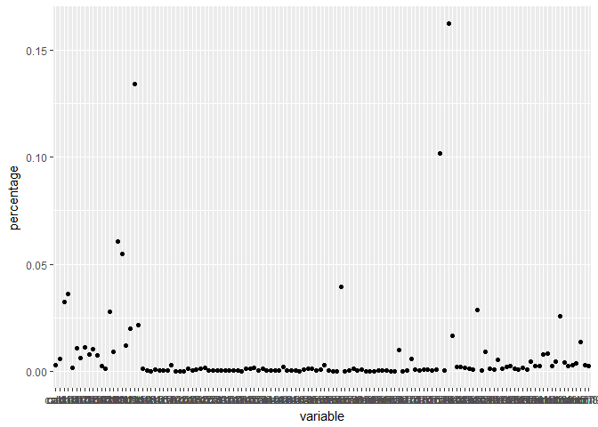

Allstate feature deduction
================
LipingLi
2016.12.24

``` r
# install.packages('h2o','ggplot2')
```

### Feature Deduction 1: Select independent variables by correlation

We saved features that selected by correlationships. But this deduction actually worsens results when testing models.

``` r
cor_reduced = c("id", "cat1", "cat15", "cat22", "cat32", "cat35", "cat38", "cat47", 
    "cat56", "cat69", "cat70", "cat71", "cat75", "cat76", "cat77", "cat78", 
    "cat79", "cat80", "cat81", "cat82", "cat83", "cat84", "cat85", "cat86", 
    "cat87", "cat88", "cat89", "cat90", "cat91", "cat92", "cat93", "cat94", 
    "cat95", "cat96", "cat97", "cat98", "cat99", "cat100", "cat101", "cat102", 
    "cat103", "cat104", "cat105", "cat106", "cat107", "cat108", "cat109", "cat110", 
    "cat111", "cat112", "cat113", "cat114", "cat115", "cat116", "cont1", "cont2", 
    "cont3", "cont4", "cont5", "cont6", "cont7", "cont8", "cont10", "cont11", 
    "cont12", "cont13", "cont14", "loss")
# write.csv(cor_reduced,'C:/data/cor_reduced.txt',row.names=F,
# colnames=c('reduced_cor_var'))
```

### Feature Deduction 2: Select independent variables by rf importance

``` r
library(h2o)
```

    ## Loading required package: statmod

    ## 
    ## ----------------------------------------------------------------------
    ## 
    ## Your next step is to start H2O:
    ##     > h2o.init()
    ## 
    ## For H2O package documentation, ask for help:
    ##     > ??h2o
    ## 
    ## After starting H2O, you can use the Web UI at http://localhost:54321
    ## For more information visit http://docs.h2o.ai
    ## 
    ## ----------------------------------------------------------------------

    ## 
    ## Attaching package: 'h2o'

    ## The following objects are masked from 'package:stats':
    ## 
    ##     cor, sd, var

    ## The following objects are masked from 'package:base':
    ## 
    ##     %*%, %in%, &&, ||, apply, as.factor, as.numeric, colnames,
    ##     colnames<-, ifelse, is.character, is.factor, is.numeric, log,
    ##     log10, log1p, log2, round, signif, trunc

``` r
h2o.init()
```

    ##  Connection successful!
    ## 
    ## R is connected to the H2O cluster: 
    ##     H2O cluster uptime:         30 minutes 6 seconds 
    ##     H2O cluster version:        3.10.0.8 
    ##     H2O cluster version age:    2 months and 13 days  
    ##     H2O cluster name:           H2O_started_from_R_lili8_mho311 
    ##     H2O cluster total nodes:    1 
    ##     H2O cluster total memory:   0.67 GB 
    ##     H2O cluster total cores:    4 
    ##     H2O cluster allowed cores:  2 
    ##     H2O cluster healthy:        TRUE 
    ##     H2O Connection ip:          localhost 
    ##     H2O Connection port:        54321 
    ##     H2O Connection proxy:       NA 
    ##     R Version:                  R version 3.3.1 (2016-06-21)

``` r
# h2o.init(nthreads = -1, max_mem_size = '4G') my laptop has 4 threads and
# 4G memory

train = h2o.importFile("C:/data/train-allstate.csv", destination_frame = "train.hex")
```

    ## 
      |                                                                       
      |                                                                 |   0%
      |                                                                       
      |================================                                 |  50%
      |                                                                       
      |=================================================================| 100%

``` r
# if using existed data frame, as.h2o can cast it to a h2o data object train
# = as.h2o(train, destination_frame='train.hex')

train = train[, -1]
features = colnames(train)[-131]
label = "loss"

# build a random forest, take few minutes
rf_model1 = h2o.randomForest(features, label, training_frame = train)
```

    ## 
      |                                                                       
      |                                                                 |   0%
      |                                                                       
      |=                                                                |   2%
      |                                                                       
      |===                                                              |   4%
      |                                                                       
      |====                                                             |   6%
      |                                                                       
      |=====                                                            |   8%
      |                                                                       
      |======                                                           |  10%
      |                                                                       
      |========                                                         |  12%
      |                                                                       
      |=========                                                        |  14%
      |                                                                       
      |==========                                                       |  16%
      |                                                                       
      |============                                                     |  18%
      |                                                                       
      |=============                                                    |  20%
      |                                                                       
      |==============                                                   |  22%
      |                                                                       
      |================                                                 |  24%
      |                                                                       
      |=================                                                |  26%
      |                                                                       
      |==================                                               |  28%
      |                                                                       
      |====================                                             |  30%
      |                                                                       
      |=====================                                            |  32%
      |                                                                       
      |======================                                           |  34%
      |                                                                       
      |=======================                                          |  36%
      |                                                                       
      |=========================                                        |  38%
      |                                                                       
      |==========================                                       |  40%
      |                                                                       
      |===========================                                      |  42%
      |                                                                       
      |=============================                                    |  44%
      |                                                                       
      |==============================                                   |  46%
      |                                                                       
      |===============================                                  |  48%
      |                                                                       
      |================================                                 |  50%
      |                                                                       
      |==================================                               |  52%
      |                                                                       
      |===================================                              |  54%
      |                                                                       
      |====================================                             |  56%
      |                                                                       
      |======================================                           |  58%
      |                                                                       
      |=======================================                          |  60%
      |                                                                       
      |========================================                         |  62%
      |                                                                       
      |==========================================                       |  64%
      |                                                                       
      |===========================================                      |  66%
      |                                                                       
      |============================================                     |  68%
      |                                                                       
      |==============================================                   |  70%
      |                                                                       
      |===============================================                  |  72%
      |                                                                       
      |================================================                 |  74%
      |                                                                       
      |=================================================                |  76%
      |                                                                       
      |===================================================              |  78%
      |                                                                       
      |====================================================             |  80%
      |                                                                       
      |=====================================================            |  82%
      |                                                                       
      |=======================================================          |  84%
      |                                                                       
      |========================================================         |  86%
      |                                                                       
      |=========================================================        |  88%
      |                                                                       
      |==========================================================       |  90%
      |                                                                       
      |============================================================     |  92%
      |                                                                       
      |=============================================================    |  94%
      |                                                                       
      |==============================================================   |  96%
      |                                                                       
      |================================================================ |  98%
      |                                                                       
      |=================================================================| 100%

``` r
# extract variable importance
imp = h2o.varimp(rf_model1)
imp = data.frame(imp)  #cast h2o object to data frame
imp = imp[order(-imp[, 4]), ]  # sort by percentage descending
# write.csv(imp,file='C:/data/imp-allstate-rf.csv')
```

``` r
library(ggplot2)
a = qplot(x = variable, y = percentage, data = imp, geom = "point")
a
```



Half of variables contribute roughly 0 variance in this rf. Show the half variables that contribute more.

``` r
imp[1:65, 1]
```

    ##  [1] "cat80"  "cat116" "cat79"  "cat112" "cat113" "cat57"  "cat101"
    ##  [8] "cat100" "cat87"  "cat110" "cont2"  "cat12"  "cat115" "cat81" 
    ## [15] "cont7"  "cat114" "cat105" "cat103" "cat107" "cat7"   "cat111"
    ## [22] "cat89"  "cont12" "cat106" "cont11" "cat108" "cat104" "cat72" 
    ## [29] "cat10"  "cat91"  "cat99"  "cont14" "cont3"  "cont6"  "cat2"  
    ## [36] "cont8"  "cat53"  "cat1"   "cont5"  "cat109" "cont1"  "cont13"
    ## [43] "cat94"  "cont9"  "cont10" "cont4"  "cat83"  "cat82"  "cat93" 
    ## [50] "cat44"  "cat84"  "cat38"  "cat97"  "cat102" "cat27"  "cat26" 
    ## [57] "cat11"  "cat37"  "cat92"  "cat5"   "cat85"  "cat95"  "cat36" 
    ## [64] "cat9"   "cat13"
