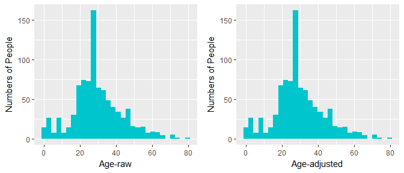
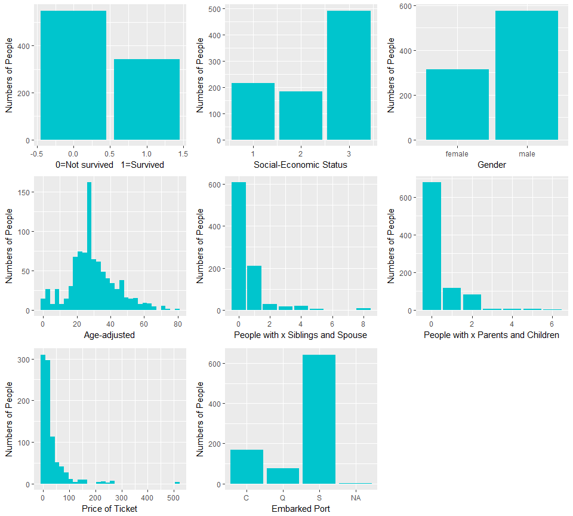
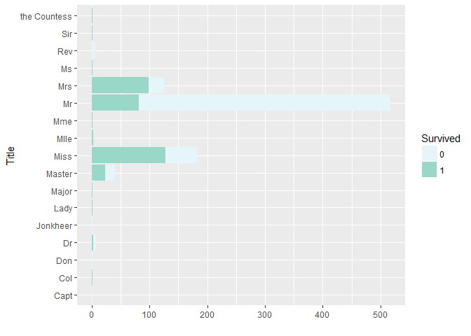
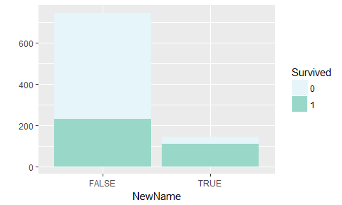
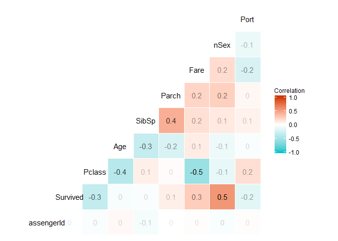
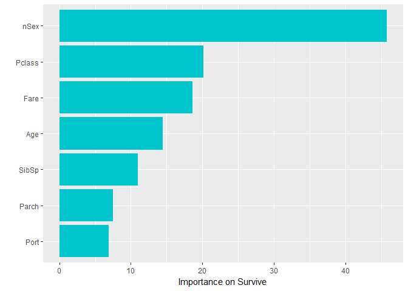
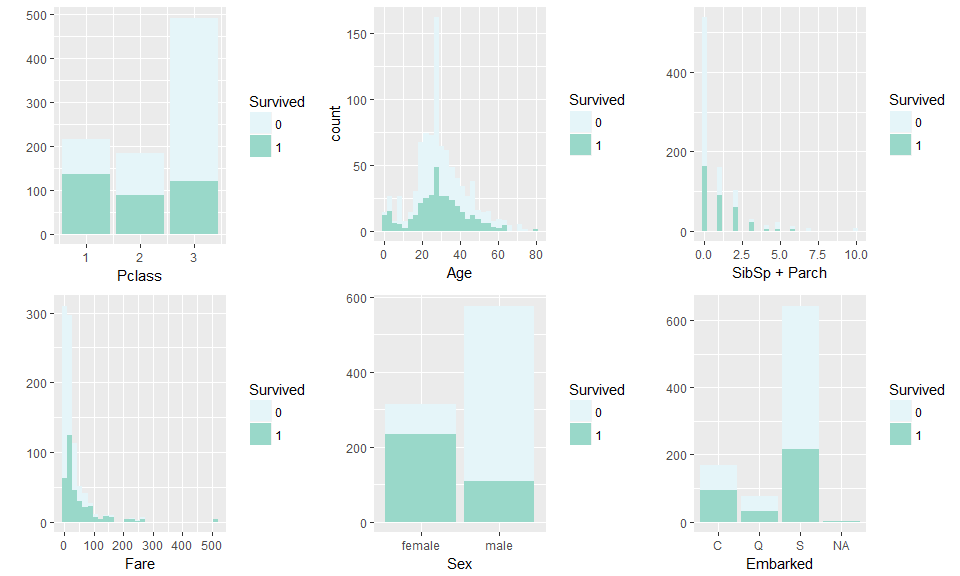

titanic-2
================
ShayleeLi
Dec 18, 2016

> By Liping <Li@Shaylee>

### -Import and Overview

``` r
library(data.table)
train = fread("train-titanic.csv", sep = ",", header = TRUE, stringsAsFactors = TRUE)
setkey(train)
summary(train)
```

    ##   PassengerId       Survived          Pclass     
    ##  Min.   :  1.0   Min.   :0.0000   Min.   :1.000  
    ##  1st Qu.:223.5   1st Qu.:0.0000   1st Qu.:2.000  
    ##  Median :446.0   Median :0.0000   Median :3.000  
    ##  Mean   :446.0   Mean   :0.3838   Mean   :2.309  
    ##  3rd Qu.:668.5   3rd Qu.:1.0000   3rd Qu.:3.000  
    ##  Max.   :891.0   Max.   :1.0000   Max.   :3.000  
    ##                                                  
    ##                                     Name         Sex           Age       
    ##  Abbing, Mr. Anthony                  :  1   female:314   Min.   : 0.42  
    ##  Abbott, Mr. Rossmore Edward          :  1   male  :577   1st Qu.:20.12  
    ##  Abbott, Mrs. Stanton (Rosa Hunt)     :  1                Median :28.00  
    ##  Abelson, Mr. Samuel                  :  1                Mean   :29.70  
    ##  Abelson, Mrs. Samuel (Hannah Wizosky):  1                3rd Qu.:38.00  
    ##  Adahl, Mr. Mauritz Nils Martin       :  1                Max.   :80.00  
    ##  (Other)                              :885                NA's   :177    
    ##      SibSp           Parch             Ticket         Fare       
    ##  Min.   :0.000   Min.   :0.0000   1601    :  7   Min.   :  0.00  
    ##  1st Qu.:0.000   1st Qu.:0.0000   347082  :  7   1st Qu.:  7.91  
    ##  Median :0.000   Median :0.0000   CA. 2343:  7   Median : 14.45  
    ##  Mean   :0.523   Mean   :0.3816   3101295 :  6   Mean   : 32.20  
    ##  3rd Qu.:1.000   3rd Qu.:0.0000   347088  :  6   3rd Qu.: 31.00  
    ##  Max.   :8.000   Max.   :6.0000   CA 2144 :  6   Max.   :512.33  
    ##                                   (Other) :852                   
    ##          Cabin     Embarked
    ##             :687    :  2   
    ##  B96 B98    :  4   C:168   
    ##  C23 C25 C27:  4   Q: 77   
    ##  G6         :  4   S:644   
    ##  C22 C26    :  3           
    ##  D          :  3           
    ##  (Other)    :186

### -Deal with Age's NAs

Age has 177 missing values. Cabin has 687 NAs and Embarked has 2. We'll can put Cabin and Embarked aside. Age is an important demographic variable, so we can try to fill with predictions.

``` r
train$Embarked = as.character(train$Embarked)  #change data type that can add NA
train[Embarked == "", `:=`(Embarked, NA)]  #set '' in Embarked as missing value
```

    ##      PassengerId Survived Pclass
    ##   1:           1        0      3
    ##   2:           2        1      1
    ##   3:           3        1      3
    ##   4:           4        1      1
    ##   5:           5        0      3
    ##  ---                            
    ## 887:         887        0      2
    ## 888:         888        1      1
    ## 889:         889        0      3
    ## 890:         890        1      1
    ## 891:         891        0      3
    ##                                                     Name    Sex Age SibSp
    ##   1:                             Braund, Mr. Owen Harris   male  22     1
    ##   2: Cumings, Mrs. John Bradley (Florence Briggs Thayer) female  38     1
    ##   3:                              Heikkinen, Miss. Laina female  26     0
    ##   4:        Futrelle, Mrs. Jacques Heath (Lily May Peel) female  35     1
    ##   5:                            Allen, Mr. William Henry   male  35     0
    ##  ---                                                                     
    ## 887:                               Montvila, Rev. Juozas   male  27     0
    ## 888:                        Graham, Miss. Margaret Edith female  19     0
    ## 889:          Johnston, Miss. Catherine Helen ""Carrie"" female  NA     1
    ## 890:                               Behr, Mr. Karl Howell   male  26     0
    ## 891:                                 Dooley, Mr. Patrick   male  32     0
    ##      Parch           Ticket    Fare Cabin Embarked
    ##   1:     0        A/5 21171  7.2500              S
    ##   2:     0         PC 17599 71.2833   C85        C
    ##   3:     0 STON/O2. 3101282  7.9250              S
    ##   4:     0           113803 53.1000  C123        S
    ##   5:     0           373450  8.0500              S
    ##  ---                                              
    ## 887:     0           211536 13.0000              S
    ## 888:     0           112053 30.0000   B42        S
    ## 889:     2       W./C. 6607 23.4500              S
    ## 890:     0           111369 30.0000  C148        C
    ## 891:     0           370376  7.7500              Q

``` r
# Tried regression model, R-square is not ideal. So take the tree method.
library(rpart)
library(ggplot2)
library(gridExtra)
age_fit2 = rpart(Age ~ Pclass + Sex + SibSp + Parch + Fare + Embarked, data = train[!is.na(Age), 
    ], na.action = na.omit, method = "anova", cp = 0.01)
page1 = qplot(train$Age, geom = "histogram", fill = I("turquoise3"), xlab = "Age-raw", 
    ylab = "Numbers of People")
train[is.na(Age), `:=`(Age, predict(age_fit2, newdata = train[is.na(Age)]))]
```

    ##      PassengerId Survived Pclass
    ##   1:           1        0      3
    ##   2:           2        1      1
    ##   3:           3        1      3
    ##   4:           4        1      1
    ##   5:           5        0      3
    ##  ---                            
    ## 887:         887        0      2
    ## 888:         888        1      1
    ## 889:         889        0      3
    ## 890:         890        1      1
    ## 891:         891        0      3
    ##                                                     Name    Sex      Age
    ##   1:                             Braund, Mr. Owen Harris   male 22.00000
    ##   2: Cumings, Mrs. John Bradley (Florence Briggs Thayer) female 38.00000
    ##   3:                              Heikkinen, Miss. Laina female 26.00000
    ##   4:        Futrelle, Mrs. Jacques Heath (Lily May Peel) female 35.00000
    ##   5:                            Allen, Mr. William Henry   male 35.00000
    ##  ---                                                                    
    ## 887:                               Montvila, Rev. Juozas   male 27.00000
    ## 888:                        Graham, Miss. Margaret Edith female 19.00000
    ## 889:          Johnston, Miss. Catherine Helen ""Carrie"" female 21.05398
    ## 890:                               Behr, Mr. Karl Howell   male 26.00000
    ## 891:                                 Dooley, Mr. Patrick   male 32.00000
    ##      SibSp Parch           Ticket    Fare Cabin Embarked
    ##   1:     1     0        A/5 21171  7.2500              S
    ##   2:     1     0         PC 17599 71.2833   C85        C
    ##   3:     0     0 STON/O2. 3101282  7.9250              S
    ##   4:     1     0           113803 53.1000  C123        S
    ##   5:     0     0           373450  8.0500              S
    ##  ---                                                    
    ## 887:     0     0           211536 13.0000              S
    ## 888:     0     0           112053 30.0000   B42        S
    ## 889:     1     2       W./C. 6607 23.4500              S
    ## 890:     0     0           111369 30.0000  C148        C
    ## 891:     0     0           370376  7.7500              Q

``` r
page2 = qplot(train$Age, geom = "histogram", fill = I("turquoise3"), xlab = "Age-adjusted", 
    ylab = "Numbers of People")
grid.arrange(page1, page2, ncol = 2)
```



The two distribution of age seem alike. That's what we want.

### -List single variable distribution except Name, Ticket and Cabin

Now, most of variables are factors and numbers. It's like that you finally pick all the vegetables and meat for dinner. Cannot wait to have a raw view.

``` r
psur = qplot(train$Survived, geom = "bar", ylab = "Numbers of People", fill = I("turquoise3"), 
    xlab = "0=Not survived   1=Survived")
ppclass = qplot(train$Pclass, geom = "bar", fill = I("turquoise3"), xlab = "Social-Economic Status", 
    ylab = "Numbers of People")
psex = qplot(train$Sex, geom = "bar", fill = I("turquoise3"), xlab = "Gender", 
    ylab = "Numbers of People")
pss = qplot(train$SibSp, geom = "bar", xlab = "People with x Siblings and Spouse", 
    ylab = "Numbers of People", fill = I("turquoise3"))
ppc = qplot(train$Parch, geom = "bar", xlab = "People with x Parents and Children", 
    ylab = "Numbers of People", fill = I("turquoise3"))
pf = qplot(train$Fare, geom = "histogram", fill = I("turquoise3"), xlab = "Price of Ticket", 
    ylab = "Numbers of People")
pe = qplot(train$Embarked, xlab = "Embarked Port", fill = I("turquoise3"), ylab = "Numbers of People", 
    geom = "bar")
grid.arrange(psur, ppclass, psex, page2, pss, ppc, pf, pe, ncol = 3)
```



Most people are in their golden ages(20~40). Most people are men. Most people are travel alone. Most people from 3rd class. Most people from Southampton. And most of them lost their lives in that adventure.

### -Interesting Thing about Name: New Name &New Life

Name has many interesting title. Let's grasp these info.

``` r
train$Title = gsub("(.*,)|(\\..*)", "", train$Name)
train$Title = as.factor(train$Title)
train$Survived = as.character(train$Survived)
ggplot(train, aes(x = Title, fill = Survived)) + geom_bar() + coord_flip() + 
    scale_fill_brewer(palette = "BuGn") + ylab("")
```



The survived "Miss"" is **no** more than married women "Mrs"" in terms of ration. I've been heard that people in Titanic give survivor opportunities to unmarried women. But according to this chart, it seems not ture. We'll dig into it later.

Another phenomenon attracts me is that many people have two names, like "Cumings, Mrs. John Bradley (Florence Briggs Thayer)". Did they change name before this tragedy or after? We don't know. Just have a look.

``` r
train$NewName = grepl("(", train$Name, fixed = TRUE)
train$Survived = as.character(train$Survived)
ggplot(train, aes(x = NewName, fill = Survived)) + geom_bar() + scale_fill_brewer(palette = "BuGn") + 
    ylab("")
```



The ration looks high for people survived to have a second name.

### -A Quick Look of Correlation and Importance: Women, Young, High Class

``` r
library(GGally)  #Only shows numeric variables
train[Sex == "male", `:=`(nSex, 1)]
```

    ##      PassengerId Survived Pclass
    ##   1:           1        0      3
    ##   2:           2        1      1
    ##   3:           3        1      3
    ##   4:           4        1      1
    ##   5:           5        0      3
    ##  ---                            
    ## 887:         887        0      2
    ## 888:         888        1      1
    ## 889:         889        0      3
    ## 890:         890        1      1
    ## 891:         891        0      3
    ##                                                     Name    Sex      Age
    ##   1:                             Braund, Mr. Owen Harris   male 22.00000
    ##   2: Cumings, Mrs. John Bradley (Florence Briggs Thayer) female 38.00000
    ##   3:                              Heikkinen, Miss. Laina female 26.00000
    ##   4:        Futrelle, Mrs. Jacques Heath (Lily May Peel) female 35.00000
    ##   5:                            Allen, Mr. William Henry   male 35.00000
    ##  ---                                                                    
    ## 887:                               Montvila, Rev. Juozas   male 27.00000
    ## 888:                        Graham, Miss. Margaret Edith female 19.00000
    ## 889:          Johnston, Miss. Catherine Helen ""Carrie"" female 21.05398
    ## 890:                               Behr, Mr. Karl Howell   male 26.00000
    ## 891:                                 Dooley, Mr. Patrick   male 32.00000
    ##      SibSp Parch           Ticket    Fare Cabin Embarked Title NewName
    ##   1:     1     0        A/5 21171  7.2500              S    Mr   FALSE
    ##   2:     1     0         PC 17599 71.2833   C85        C   Mrs    TRUE
    ##   3:     0     0 STON/O2. 3101282  7.9250              S  Miss   FALSE
    ##   4:     1     0           113803 53.1000  C123        S   Mrs    TRUE
    ##   5:     0     0           373450  8.0500              S    Mr   FALSE
    ##  ---                                                                  
    ## 887:     0     0           211536 13.0000              S   Rev   FALSE
    ## 888:     0     0           112053 30.0000   B42        S  Miss   FALSE
    ## 889:     1     2       W./C. 6607 23.4500              S  Miss   FALSE
    ## 890:     0     0           111369 30.0000  C148        C    Mr   FALSE
    ## 891:     0     0           370376  7.7500              Q    Mr   FALSE
    ##      nSex
    ##   1:    1
    ##   2:   NA
    ##   3:   NA
    ##   4:   NA
    ##   5:    1
    ##  ---     
    ## 887:    1
    ## 888:   NA
    ## 889:   NA
    ## 890:    1
    ## 891:    1

``` r
train[Sex == "female", `:=`(nSex, 2)]
```

    ##      PassengerId Survived Pclass
    ##   1:           1        0      3
    ##   2:           2        1      1
    ##   3:           3        1      3
    ##   4:           4        1      1
    ##   5:           5        0      3
    ##  ---                            
    ## 887:         887        0      2
    ## 888:         888        1      1
    ## 889:         889        0      3
    ## 890:         890        1      1
    ## 891:         891        0      3
    ##                                                     Name    Sex      Age
    ##   1:                             Braund, Mr. Owen Harris   male 22.00000
    ##   2: Cumings, Mrs. John Bradley (Florence Briggs Thayer) female 38.00000
    ##   3:                              Heikkinen, Miss. Laina female 26.00000
    ##   4:        Futrelle, Mrs. Jacques Heath (Lily May Peel) female 35.00000
    ##   5:                            Allen, Mr. William Henry   male 35.00000
    ##  ---                                                                    
    ## 887:                               Montvila, Rev. Juozas   male 27.00000
    ## 888:                        Graham, Miss. Margaret Edith female 19.00000
    ## 889:          Johnston, Miss. Catherine Helen ""Carrie"" female 21.05398
    ## 890:                               Behr, Mr. Karl Howell   male 26.00000
    ## 891:                                 Dooley, Mr. Patrick   male 32.00000
    ##      SibSp Parch           Ticket    Fare Cabin Embarked Title NewName
    ##   1:     1     0        A/5 21171  7.2500              S    Mr   FALSE
    ##   2:     1     0         PC 17599 71.2833   C85        C   Mrs    TRUE
    ##   3:     0     0 STON/O2. 3101282  7.9250              S  Miss   FALSE
    ##   4:     1     0           113803 53.1000  C123        S   Mrs    TRUE
    ##   5:     0     0           373450  8.0500              S    Mr   FALSE
    ##  ---                                                                  
    ## 887:     0     0           211536 13.0000              S   Rev   FALSE
    ## 888:     0     0           112053 30.0000   B42        S  Miss   FALSE
    ## 889:     1     2       W./C. 6607 23.4500              S  Miss   FALSE
    ## 890:     0     0           111369 30.0000  C148        C    Mr   FALSE
    ## 891:     0     0           370376  7.7500              Q    Mr   FALSE
    ##      nSex
    ##   1:    1
    ##   2:    2
    ##   3:    2
    ##   4:    2
    ##   5:    1
    ##  ---     
    ## 887:    1
    ## 888:    2
    ## 889:    2
    ## 890:    1
    ## 891:    1

``` r
train[Embarked == "C", `:=`(Port, 1)]
```

    ##      PassengerId Survived Pclass
    ##   1:           1        0      3
    ##   2:           2        1      1
    ##   3:           3        1      3
    ##   4:           4        1      1
    ##   5:           5        0      3
    ##  ---                            
    ## 887:         887        0      2
    ## 888:         888        1      1
    ## 889:         889        0      3
    ## 890:         890        1      1
    ## 891:         891        0      3
    ##                                                     Name    Sex      Age
    ##   1:                             Braund, Mr. Owen Harris   male 22.00000
    ##   2: Cumings, Mrs. John Bradley (Florence Briggs Thayer) female 38.00000
    ##   3:                              Heikkinen, Miss. Laina female 26.00000
    ##   4:        Futrelle, Mrs. Jacques Heath (Lily May Peel) female 35.00000
    ##   5:                            Allen, Mr. William Henry   male 35.00000
    ##  ---                                                                    
    ## 887:                               Montvila, Rev. Juozas   male 27.00000
    ## 888:                        Graham, Miss. Margaret Edith female 19.00000
    ## 889:          Johnston, Miss. Catherine Helen ""Carrie"" female 21.05398
    ## 890:                               Behr, Mr. Karl Howell   male 26.00000
    ## 891:                                 Dooley, Mr. Patrick   male 32.00000
    ##      SibSp Parch           Ticket    Fare Cabin Embarked Title NewName
    ##   1:     1     0        A/5 21171  7.2500              S    Mr   FALSE
    ##   2:     1     0         PC 17599 71.2833   C85        C   Mrs    TRUE
    ##   3:     0     0 STON/O2. 3101282  7.9250              S  Miss   FALSE
    ##   4:     1     0           113803 53.1000  C123        S   Mrs    TRUE
    ##   5:     0     0           373450  8.0500              S    Mr   FALSE
    ##  ---                                                                  
    ## 887:     0     0           211536 13.0000              S   Rev   FALSE
    ## 888:     0     0           112053 30.0000   B42        S  Miss   FALSE
    ## 889:     1     2       W./C. 6607 23.4500              S  Miss   FALSE
    ## 890:     0     0           111369 30.0000  C148        C    Mr   FALSE
    ## 891:     0     0           370376  7.7500              Q    Mr   FALSE
    ##      nSex Port
    ##   1:    1   NA
    ##   2:    2    1
    ##   3:    2   NA
    ##   4:    2   NA
    ##   5:    1   NA
    ##  ---          
    ## 887:    1   NA
    ## 888:    2   NA
    ## 889:    2   NA
    ## 890:    1    1
    ## 891:    1   NA

``` r
train[Embarked == "Q", `:=`(Port, 2)]
```

    ##      PassengerId Survived Pclass
    ##   1:           1        0      3
    ##   2:           2        1      1
    ##   3:           3        1      3
    ##   4:           4        1      1
    ##   5:           5        0      3
    ##  ---                            
    ## 887:         887        0      2
    ## 888:         888        1      1
    ## 889:         889        0      3
    ## 890:         890        1      1
    ## 891:         891        0      3
    ##                                                     Name    Sex      Age
    ##   1:                             Braund, Mr. Owen Harris   male 22.00000
    ##   2: Cumings, Mrs. John Bradley (Florence Briggs Thayer) female 38.00000
    ##   3:                              Heikkinen, Miss. Laina female 26.00000
    ##   4:        Futrelle, Mrs. Jacques Heath (Lily May Peel) female 35.00000
    ##   5:                            Allen, Mr. William Henry   male 35.00000
    ##  ---                                                                    
    ## 887:                               Montvila, Rev. Juozas   male 27.00000
    ## 888:                        Graham, Miss. Margaret Edith female 19.00000
    ## 889:          Johnston, Miss. Catherine Helen ""Carrie"" female 21.05398
    ## 890:                               Behr, Mr. Karl Howell   male 26.00000
    ## 891:                                 Dooley, Mr. Patrick   male 32.00000
    ##      SibSp Parch           Ticket    Fare Cabin Embarked Title NewName
    ##   1:     1     0        A/5 21171  7.2500              S    Mr   FALSE
    ##   2:     1     0         PC 17599 71.2833   C85        C   Mrs    TRUE
    ##   3:     0     0 STON/O2. 3101282  7.9250              S  Miss   FALSE
    ##   4:     1     0           113803 53.1000  C123        S   Mrs    TRUE
    ##   5:     0     0           373450  8.0500              S    Mr   FALSE
    ##  ---                                                                  
    ## 887:     0     0           211536 13.0000              S   Rev   FALSE
    ## 888:     0     0           112053 30.0000   B42        S  Miss   FALSE
    ## 889:     1     2       W./C. 6607 23.4500              S  Miss   FALSE
    ## 890:     0     0           111369 30.0000  C148        C    Mr   FALSE
    ## 891:     0     0           370376  7.7500              Q    Mr   FALSE
    ##      nSex Port
    ##   1:    1   NA
    ##   2:    2    1
    ##   3:    2   NA
    ##   4:    2   NA
    ##   5:    1   NA
    ##  ---          
    ## 887:    1   NA
    ## 888:    2   NA
    ## 889:    2   NA
    ## 890:    1    1
    ## 891:    1    2

``` r
train[Embarked == "S", `:=`(Port, 3)]
```

    ##      PassengerId Survived Pclass
    ##   1:           1        0      3
    ##   2:           2        1      1
    ##   3:           3        1      3
    ##   4:           4        1      1
    ##   5:           5        0      3
    ##  ---                            
    ## 887:         887        0      2
    ## 888:         888        1      1
    ## 889:         889        0      3
    ## 890:         890        1      1
    ## 891:         891        0      3
    ##                                                     Name    Sex      Age
    ##   1:                             Braund, Mr. Owen Harris   male 22.00000
    ##   2: Cumings, Mrs. John Bradley (Florence Briggs Thayer) female 38.00000
    ##   3:                              Heikkinen, Miss. Laina female 26.00000
    ##   4:        Futrelle, Mrs. Jacques Heath (Lily May Peel) female 35.00000
    ##   5:                            Allen, Mr. William Henry   male 35.00000
    ##  ---                                                                    
    ## 887:                               Montvila, Rev. Juozas   male 27.00000
    ## 888:                        Graham, Miss. Margaret Edith female 19.00000
    ## 889:          Johnston, Miss. Catherine Helen ""Carrie"" female 21.05398
    ## 890:                               Behr, Mr. Karl Howell   male 26.00000
    ## 891:                                 Dooley, Mr. Patrick   male 32.00000
    ##      SibSp Parch           Ticket    Fare Cabin Embarked Title NewName
    ##   1:     1     0        A/5 21171  7.2500              S    Mr   FALSE
    ##   2:     1     0         PC 17599 71.2833   C85        C   Mrs    TRUE
    ##   3:     0     0 STON/O2. 3101282  7.9250              S  Miss   FALSE
    ##   4:     1     0           113803 53.1000  C123        S   Mrs    TRUE
    ##   5:     0     0           373450  8.0500              S    Mr   FALSE
    ##  ---                                                                  
    ## 887:     0     0           211536 13.0000              S   Rev   FALSE
    ## 888:     0     0           112053 30.0000   B42        S  Miss   FALSE
    ## 889:     1     2       W./C. 6607 23.4500              S  Miss   FALSE
    ## 890:     0     0           111369 30.0000  C148        C    Mr   FALSE
    ## 891:     0     0           370376  7.7500              Q    Mr   FALSE
    ##      nSex Port
    ##   1:    1    3
    ##   2:    2    1
    ##   3:    2    3
    ##   4:    2    3
    ##   5:    1    3
    ##  ---          
    ## 887:    1    3
    ## 888:    2    3
    ## 889:    2    3
    ## 890:    1    1
    ## 891:    1    2

``` r
train$Survived = as.numeric(train$Survived)
ggcorr(train, label = TRUE, label_alpha = TRUE, name = "Correlation", low = "turquoise3", 
    mid = "white", high = "orangered3")
```



``` r
library(randomForest)
rf = randomForest(Survived ~ Pclass + Age + nSex + Parch + SibSp + Fare + Port, 
    data = train, na.action = na.omit, ntree = 101, importance = TRUE)
imp = importance(rf, type = 1)
featureImportance = data.frame(Feature = row.names(imp), Importance = imp[, 
    1])
ggplot(featureImportance, aes(x = reorder(Feature, Importance), y = Importance)) + 
    geom_bar(stat = "identity", fill = I("turquoise3")) + coord_flip() + xlab("") + 
    ylab("Importance on Survive")
```



Women, people of young age and people of higher class are more likely to survive.

### -X with Survived

Take a close look of every independent variable influence on survive. This time add SibSp and Parch as family size

``` r
train$Survived = as.character(train$Survived)
SurPc = ggplot(train, aes(x = Pclass, fill = Survived)) + geom_bar() + scale_fill_brewer(palette = "BuGn") + 
    ylab("")
Surage = ggplot(train, aes(x = Age, fill = Survived)) + geom_histogram() + scale_fill_brewer(palette = "BuGn")
SurFam = ggplot(train, aes(x = SibSp + Parch, fill = Survived)) + geom_histogram() + 
    scale_fill_brewer(palette = "BuGn") + ylab("")
SurFare = ggplot(train, aes(x = Fare, fill = Survived)) + geom_histogram() + 
    scale_fill_brewer(palette = "BuGn") + ylab("")
SurSex = ggplot(train, aes(x = Sex, fill = Survived)) + geom_bar() + scale_fill_brewer(palette = "BuGn") + 
    ylab("")
SurEmbarked = ggplot(train, aes(x = Embarked, fill = Survived)) + geom_bar() + 
    scale_fill_brewer(palette = "BuGn") + ylab("")
grid.arrange(SurPc, Surage, SurFam, SurFare, SurSex, SurEmbarked, ncol = 3)
```



From the diagram, we have a guess: people who are women, young but not too young, have 1-2 companies have more chance to survive.
